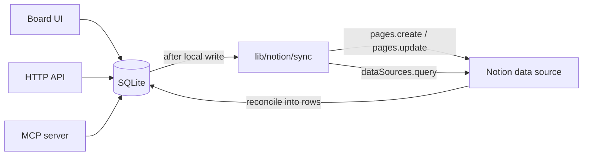

# Job tracker

Local kanban for job applications. The UI, HTTP API, and MCP server all write to the same SQLite file so agents can log applications and the board stays in sync.

Application data lives in `data/tracker.db` and is gitignored. The public repo is the app, not your pipeline.

## Setup

```bash
pnpm install
pnpm dev
```

Open [http://localhost:3000](http://localhost:3000).

## Notion

Optional two-way sync. The board, HTTP API, and MCP stay local-first. SQLite is the source of truth; Notion is a replica you can connect from the **Notion** button in the header.



Setup from the UI:

1. Create an [internal integration](https://www.notion.so/my-integrations) and copy the secret.
2. Create or open a Notion database and share it with the integration (**••• → Connections**).
3. Paste the token and database ID (or the database URL) into the dialog and **Connect**.

You can also set `NOTION_TOKEN` and `NOTION_DATABASE_ID` in the environment; those override the UI. Disconnect in the dialog (or unset the env vars) to go back to local-only. Existing SQLite rows are kept.

Agents can call `sync_notion` when connected. `POST /api/notion/sync` runs the same reconcile.

## MCP (agents)

Cursor is already wired via `.cursor/mcp.json`. From this repo:

```bash
pnpm mcp
```

That process talks to SQLite directly (`pnpm dev` does not need to be running). Prefer `search_applications` before `upsert_application`. Writes are idempotent on `jobUrl`.

Example tool arguments:

```json
{
  "company": "Acme",
  "role": "Staff Engineer",
  "stage": "applied",
  "jobUrl": "https://example.com/jobs/staff",
  "source": "linkedin",
  "notes": "JD: distributed systems, 8+ years."
}
```

## HTTP

With `pnpm dev` running:

```bash
curl -s http://localhost:3000/api/applications \
  -H 'content-type: application/json' \
  -d '{"company":"Acme","role":"Staff Engineer","jobUrl":"https://example.com/jobs/staff"}'
```

`POST /api/applications` upserts (same `jobUrl` updates). See `app/api/applications/` for list, bulk, move, archive, and delete.
